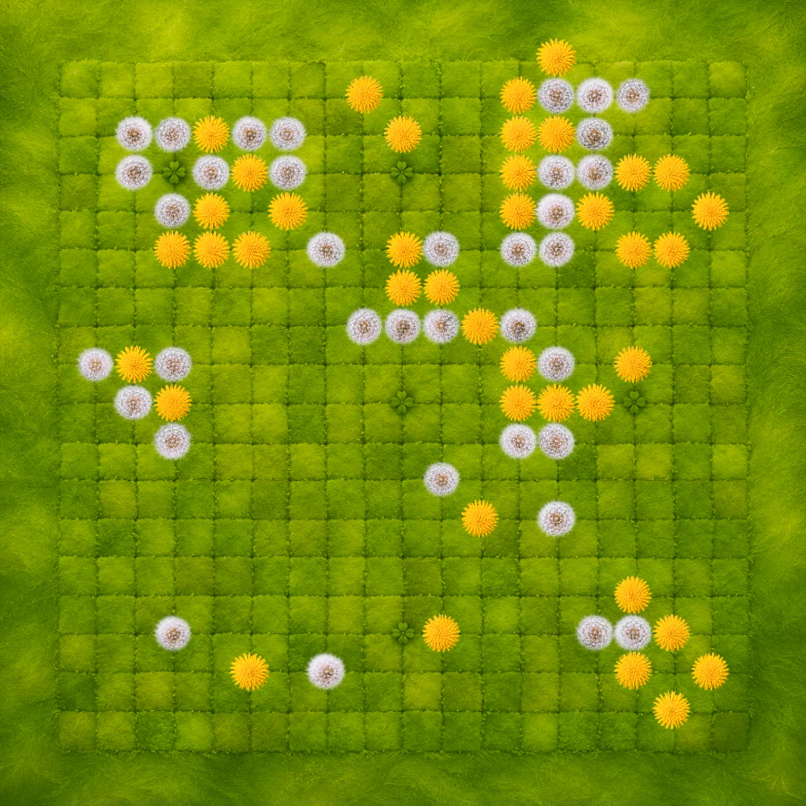
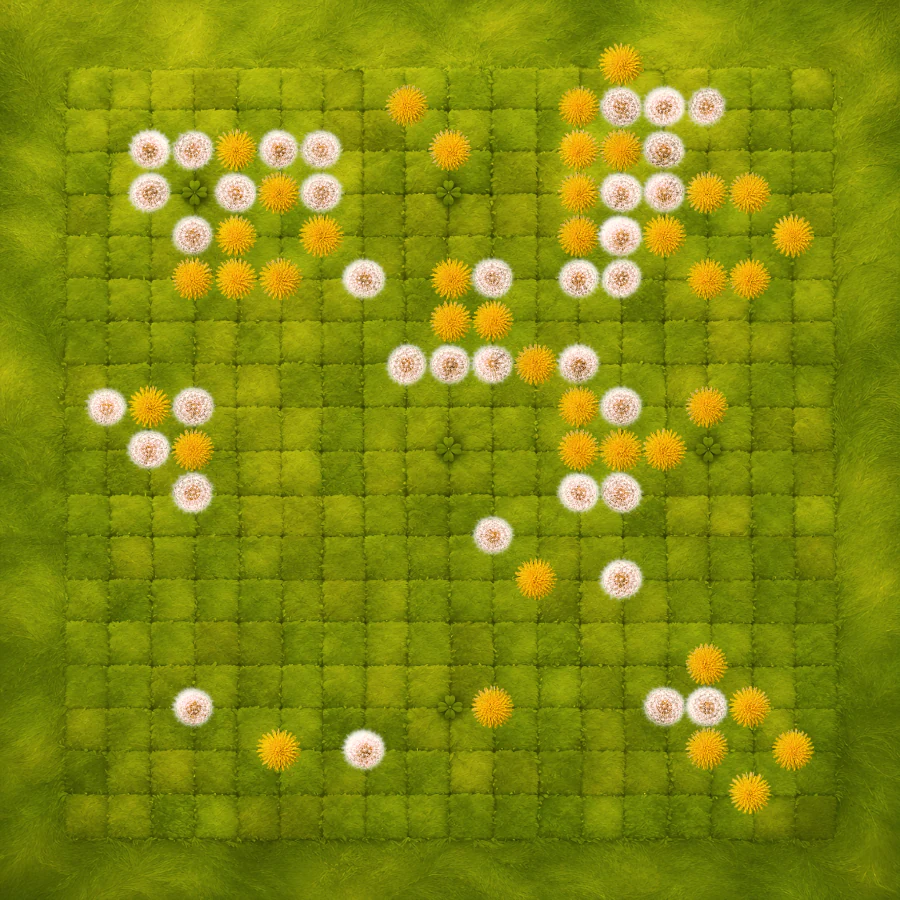

# Goban Decals

Beautiful stylized goban themes with illustrated boards and varied stones.

| Theme | Preview | Variants |
| --- | --- | --- |
| [Sand and Pebbles](themes/sand-and-pebbles/) |  | Dark and light pebbles |
| [Flowering Meadow — Daylight](themes/flowering-meadow-daylight-yellow-white/) |  | Yellow and white dandelions |
| [Flowering Meadow — Sunset](themes/flowering-meadow-sunset-yellow-white/) |  | Yellow and white dandelions |

Each theme page contains installation instructions for its supported clients.
The images used by OGS are served through GitHub Pages, while Sabaki packages
are published under [Releases](https://github.com/lykahb/goban-decals/releases).

## License

Theme artwork and documentation are licensed under
[CC BY-NC 4.0](https://creativecommons.org/licenses/by-nc/4.0/). See
[LICENSE.md](LICENSE.md) for details.
