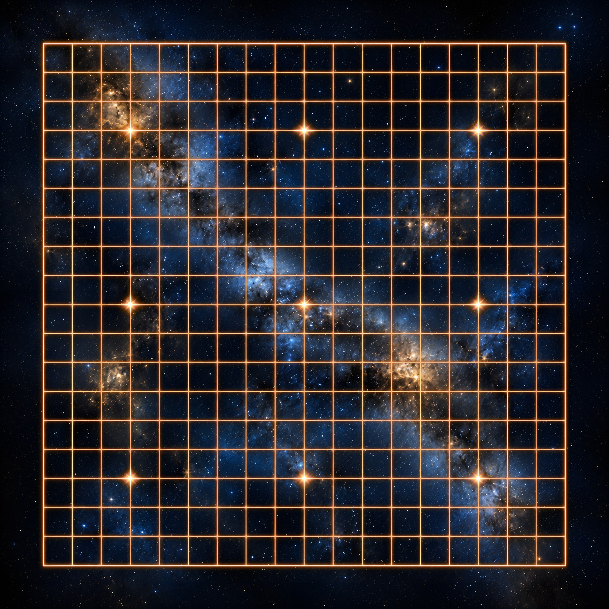

# Goban Decals

Beautiful stylized goban themes with illustrated boards and varied stones.

| Theme | Preview | Variants |
| --- | --- | --- |
| [Sand and Pebbles](themes/sand-and-pebbles/) |  | - Pebbles on a beach |
| [Flowering Meadow](themes/flowering-meadow/) |  | - Daylight lighting<br>- Sunset lighting |
| [Starfield](themes/starfield/) |  | - Red and yellow orbs<br>- Blue and yellow orbs |

Each theme page contains installation instructions for its supported clients.
The images used by OGS are served through GitHub Pages, while Sabaki packages
are published under [Releases](https://github.com/lykahb/goban-decals/releases).

## Building a Sabaki theme

Use the shared builder with explicit locations for the checked-in Sabaki files,
boards, and stones:

```bash
scripts/pack-sabaki.sh \
  --sabaki themes/starfield/variants/red-yellow/sabaki \
  --boards themes/starfield/assets/boards \
  --stones themes/starfield/variants/red-yellow/assets/stones
```

The archive name comes from `sabaki/package.json` and the default output is
`dist/<package-name>.asar`. Pass `--output FILE` to write it elsewhere. The
builder packages existing CSS unchanged; it does not generate theme files.

## License

Theme artwork and documentation are licensed under
[CC BY-NC 4.0](https://creativecommons.org/licenses/by-nc/4.0/). See
[LICENSE.md](LICENSE.md) for details.
