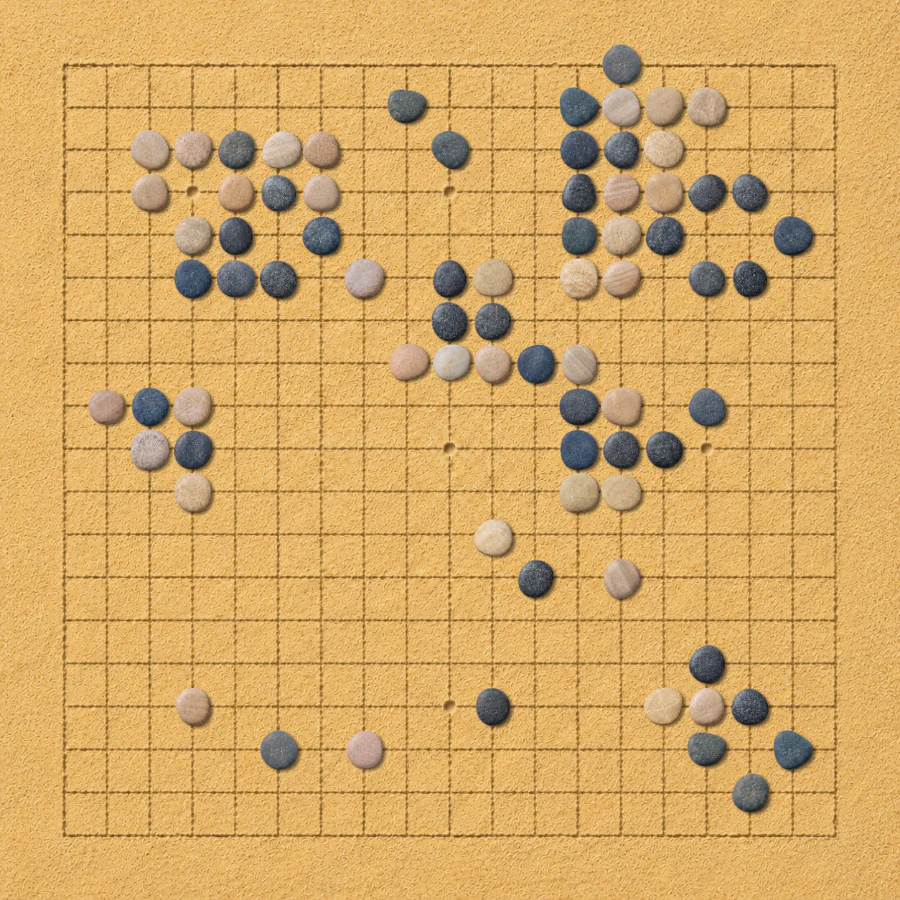
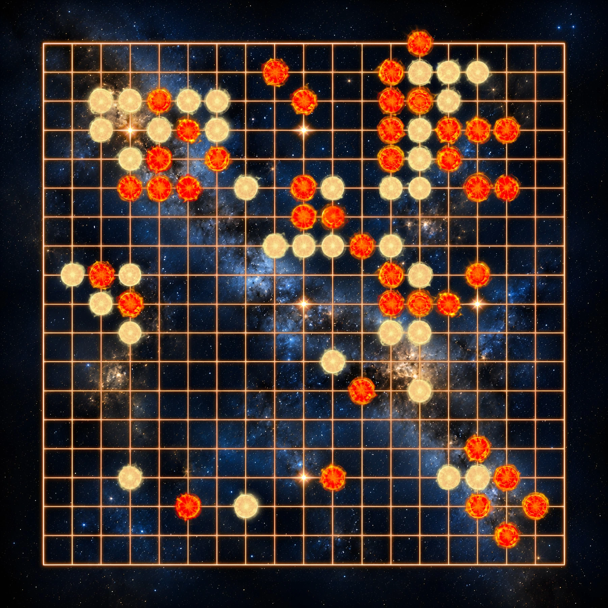
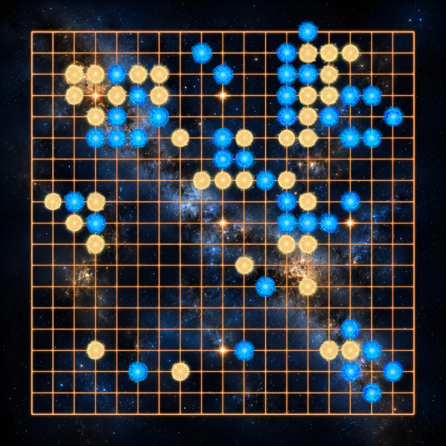

# Goban Decals

Beautiful stylized goban themes with illustrated boards and varied stones.

A typical Go client displays a wood-textured board with a plain vector grid drawn over it. In contrast, board games, novelty chess sets, and card decks have more variety of styles and often blend gameplay elements carefully into their visual themes. My goal is to bring that variety and visual appeal to Go.

These themes integrate the grid naturally into the board artwork and include dozens of stone variants.

| Theme | Preview |
| --- | --- |
| [Sand and Pebbles](themes/sand-and-pebbles/) Variants: - Pebbles on a beach |  |
| [Flowering Meadow](themes/flowering-meadow/) Variants: - Daylight lighting - Sunset lighting  |   |
| [Starfield](themes/starfield/) Variants: - Red and yellow orbs - Blue and yellow orbs  |   |

Each theme page contains installation instructions for OGS, Pandanet and Sabaki.

The Sabaki packages are published under [Releases](https://github.com/lykahb/goban-decals/releases). The boards are best displayed on `0.60.3` or later.

Thanks to the client maintainers who accepted the changes needed to support these themes.

## License

Artwork is licensed under
[CC BY-NC 4.0](https://creativecommons.org/licenses/by-nc/4.0/). Scripts, CSS,
configuration, documentation, and other non-artwork files are licensed under
the MIT License. See [LICENSE.md](LICENSE.md) for details.

The artwork was developed with AI assistance using curated reference material, including original photography, and custom geometric guide images. Generated material was substantially edited and adapted to meet the geometric constraints and improve the visuals.
